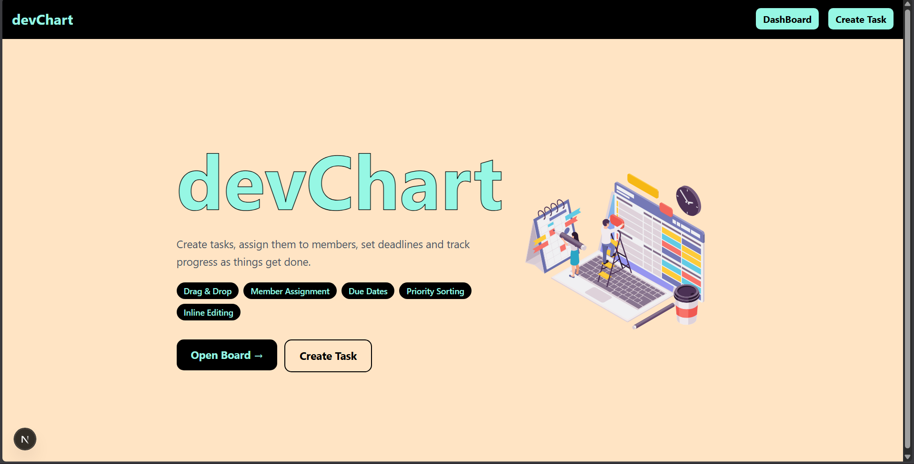
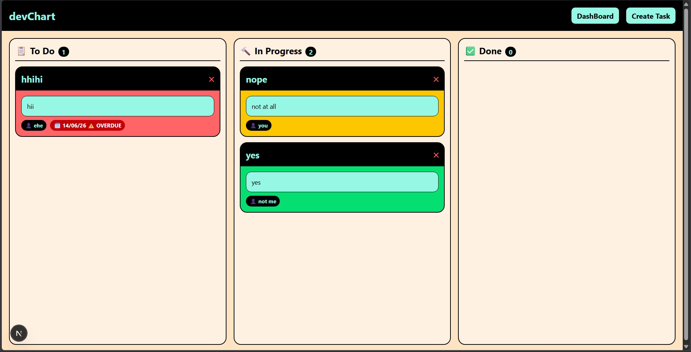
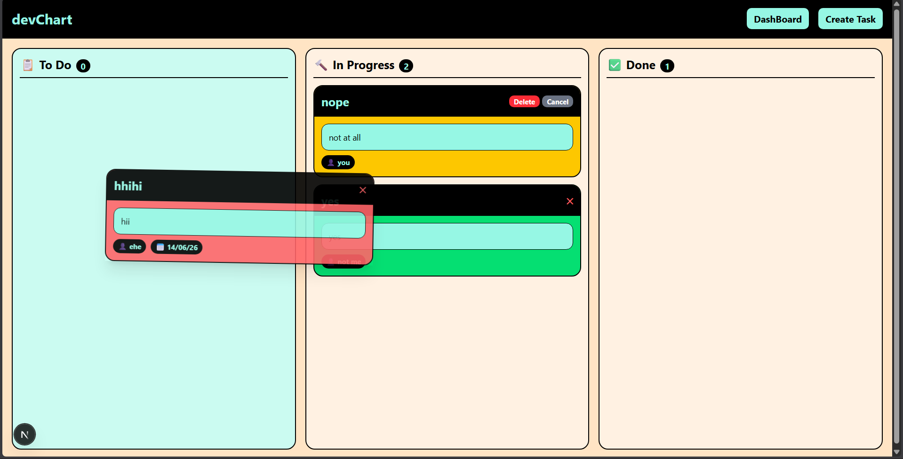
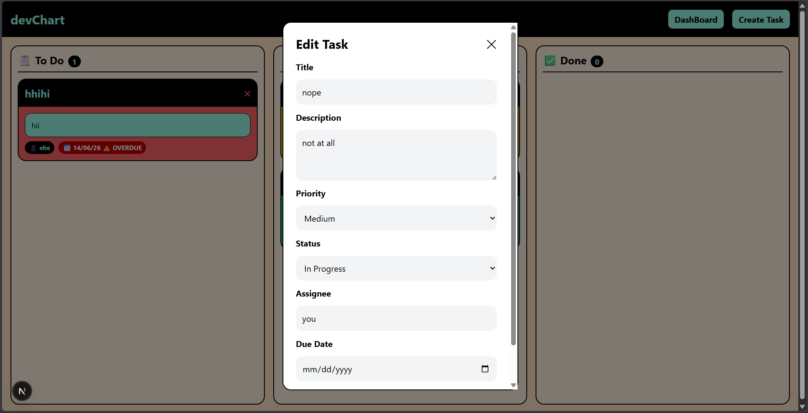
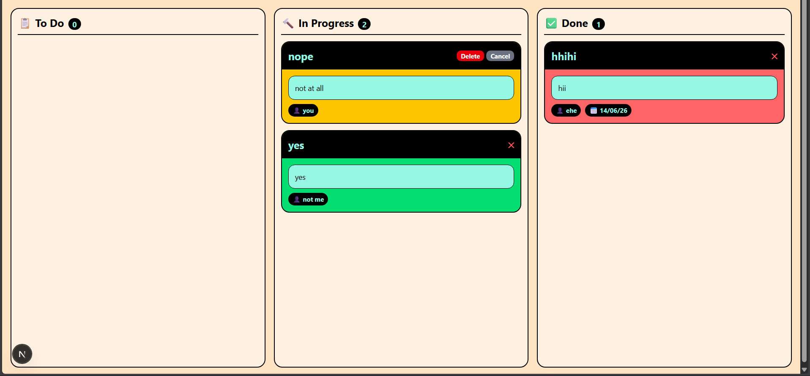
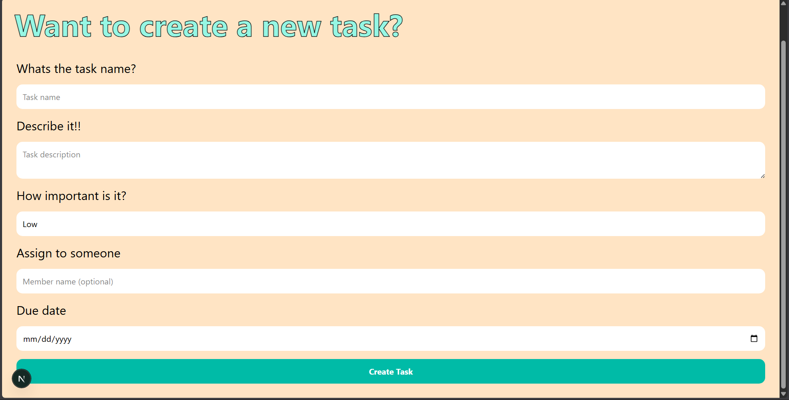

# devChart

A task management web app with a Kanban board. Fork of [ChinmayBabu/devChart](https://github.com/ChinmayBabu/devChart) extended with drag-and-drop task stages, member assignment, due date tracking and inline task editing.

**Live:** [dev-chart-tau.vercel.app](https://dev-chart-tau.vercel.app/)

## Features

**Kanban Board**
Tasks are organized into three columns: To Do, In Progress and Done. You can drag tasks between columns and the status is saved to the database instantly.

**Member Assignment**
Each task can be assigned to a team member. The assignee shows up as a tag on the task card.

**Due Dates with Overdue Alerts**
Tasks can have a due date. If a task is past its deadline and not in the Done column, it gets flagged with an overdue warning in red.

**Inline Task Editing**
Click any task card to open an edit modal where you can update the title, description, priority, status, assignee and due date.

**Priority Sorting**
Tasks within each column are automatically sorted by priority. High priority tasks appear at the top.

**Task Deletion**
Tasks can be deleted from the board with an inline confirmation.

## Tech Stack

- **Next.js 16** (React 19, App Router)
- **MongoDB Atlas** with Mongoose
- **Tailwind CSS v4**
- **@hello-pangea/dnd** for drag and drop
- **Vercel** for deployment

## Setup Instructions

1. Fork and clone the repo

```
git clone https://github.com/skysoart/devChart.git
cd devChart
```

2. Install dependencies

```
npm install
```

3. Create a `.env.local` file in the root directory and add your MongoDB connection string

```
MONGODB_URI=your_mongodb_connection_string
```

You can get this from MongoDB Atlas. Go to your cluster, click Connect and copy the connection string. Replace the password and database name accordingly.

4. Run the development server

```
npm run dev
```

5. Open `http://localhost:3000` in your browser

## Deployment

Deployed on Vercel at [dev-chart-tau.vercel.app](https://dev-chart-tau.vercel.app/)

To deploy your own:

1. Push the repo to GitHub
2. Go to [vercel.com](https://vercel.com) and sign in with GitHub
3. Import your repo and add `MONGODB_URI` as an environment variable in the project settings
4. Click Deploy

## Screenshots

### Landing Page


### Dashboard


### Drag and Drop


### Edit Task Modal


### Delete Confirmation


### Create Task


## Known Limitations

- There is no user authentication. Anyone with the link can create, edit and delete tasks.
- Drag and drop reordering within the same column does not persist because tasks are sorted by priority automatically.
- The assignee field is a free text input rather than a dropdown of registered members.